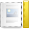
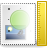
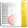

# Tango Icon Theme

A modest renaissance of [Freedesktop's Tango Desktop Project](https://en.wikipedia.org/wiki/Tango_Desktop_Project).

This is a fork from [sebkur/tango-icon-theme](http://github.com/sebkur/tango-icon-theme).

> #  Origin
> This was a long process of digital archaeology...
>
> 1. [tango-icon-theme-0.8.90.tar.bz2](http://tango.freedesktop.org/releases/tango-icon-theme-0.8.90.tar.bz2) final release available on freedesktop.org, **but it provides PNG only, except 48x48 are in SVG**. The official site of Freedesktop Tango Project has already been down... This URL is found in [AUR](https://aur.archlinux.org/packages/tango-icon-theme)...
> 2. Git repo ([cgit](https://cgit.freedesktop.org/tango/tango-icon-theme/), [gitlab](https://gitlab.freedesktop.org/tango/tango-icon-theme)) can be found in [freedesktop](https://cgit.freedesktop.org/), **but it lacks lots of original Tango icons... It looks more like... a draft of `gnome-icon-theme`**. Maybe it was faults of the administrators of freedesktop.org when migrating CVS server into git repo, mistakenly excluded lots of old SVG source code... Argh.
> 3. **Fortunately, [Debian's package server](https://tracker.debian.org/pkg/tango-icon-theme) still** remains a full (I guess) snapshot of source code and VCS ([src pkg](https://sources.debian.org/src/tango-icon-theme/0.9.0-1), [git](https://git.golem.linux.it/matteobin/tango-icon-theme)), contains many useful SVG files! Heritage of forgotten ancient civilizations! **Thank you Debian!**
>   - However, the source code git repo I found on Debian already contains only 1 initial commit... No commit history is preserved... But its `README.md` described:
>     > This is a fork of Tango icon theme based on the 0.8.90-11 version of the Debian package and this Git repository <https://github.com/sebkur/tango-icon-theme>, to add XDG user directory icons, PDF MIME type icon, restore the missing scalable mail-mark-not-junk.svg icon from 0.8.90, and include some Debian patches. Tango icon theme was forked because upstream is dead.
> 4. **At last**, I found [sebkur/tango-icon-theme](http://github.com/sebkur/tango-icon-theme) still preserves commit history, so **I decide to fork it**. (out of nostalgia, respect to the original authors, and as records of the history of the Linux desktop in the 2000s.)

#  Why Fork?

Maintenance of the original version of `tango-icon-theme` has been discontinued, and was relicensed from CC-BY-SA 2.5 into the Public Domain (as stated in the [0.8.90 tarball](http://tango.freedesktop.org/releases/tango-icon-theme-0.8.90.tar.bz2)) on [2009-02-26](https://tango.freedesktop.org/releases/) by original authors, **"Tango Desktop Project contributors from freedesktop.org"**.

I love Tango Icons, and I don't want this wonderful icon theme and these great authors be forgotten in the tide of an era dominated by flat design. So I forked `tango-icon-theme`, try to keep the spirit and legacy of "Tango Desktop Project" alive.

## Differences against the vanilla version

- Lots of source file of Tango Icon Theme is already `*.xcf` instead of `*.svg`, so if I have time, they may be (slowly) re-drawn to SVG manually...
- `scalable/` is renamed to `48x48/` because they are really 48x48.
- Draw more icons.
- As an alternative of Ubuntu Humanity or GNOME Icon Theme, especially for the compatibility of GPLv2/v3, the mainstream licenses of Linux GUI applications.

#  License

Copyright (c) 2005-2009, 2021, 2026. freedesktop.org Tango Desktop Project contributors.

This project is dual-licensed under the terms of the GNU General Public License version 2 or version 3 (in your option); the "any later version" clause does NOT apply. See [LICENSES/GPL-2.0-only.txt](LICENSES/GPL-2.0-only.txt) and [LICENSES/GPL-3.0-only.txt](LICENSES/GPL-3.0-only.txt) for the full text.

This choice was made to maximize compatibility with GPL-licensed GUI applications (mainstream in FLOSS GUI applications) and to lower the barrier for contribution. Thanks for your understanding.

> [!NOTE]
> ### Credits
> After all, one of a goal I forked `tango-icon-theme` is to make Tango Desktop Project not to be forgotten. Therefore, while GPLv2 and GPLv3 licenses do not permit adding extra obligations, **we would greatly appreciate it if you choose to credit the original authors `Tango Desktop Project contributors from freedesktop.org` in your project**, either in about UI, documentation, or acknowledgements.
>
> This is a voluntary request and has **no** effect on your rights under the GPL.

------

# Original README from [sebkur/tango-icon-theme](http://github.com/sebkur/tango-icon-theme)

This is an icon theme that follows the [Tango visual guidelines][1]. Currently
it depends on Imagemagick for creation of 24x24 bitmaps by adding a 1px padding
around the 22x22px version. For GNOME and KDE you will also need
icon-naming-utils that allow the theme to work in these environments before
they follow [the new naming scheme][2].

## Information about the Tango icons elsewhere on the web

There's a [Wikipedia article][3]. Also Wikimedia Commons has
[a page][4] about the icons that includes more icons than the ones
available in this repository.
The [Gnome desktop icons] are also similar but contains more and
partially different icons than Tango.

[1]: http://tango.freedesktop.org/Tango_Icon_Theme_Guidelines
[2]: http://tango.freedesktop.org/Standard_Icon_Naming_Specification
[3]: https://en.wikipedia.org/wiki/Tango_Desktop_Project
[4]: https://commons.wikimedia.org/wiki/Tango_icons
[5]: https://commons.wikimedia.org/wiki/GNOME_Desktop_icons

## actions

## apps

## categories

## devices

## emblems

## emotes

## mimetypes

## misc

## places

## status

